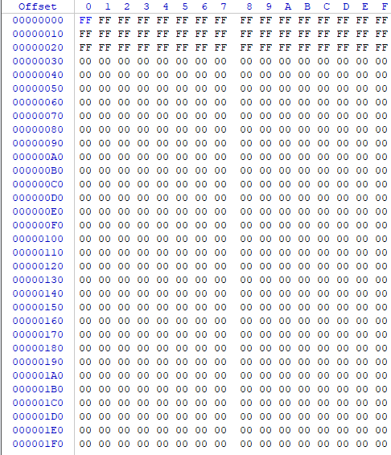
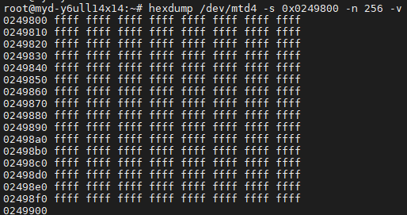
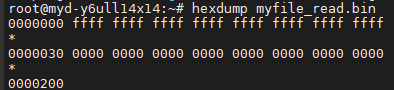
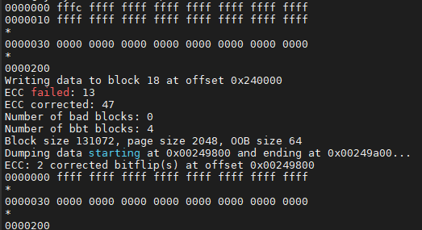
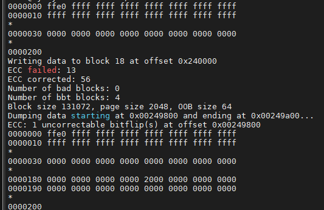

### 判定nandflash的纠错能力

#### 基本思路：
1.用带ecc算法的指令，写一个扇区大小的bin文件到某个指定扇区。 nandwrite
2.将bin文件修改一个bit, 用不带ecc算法的指令，写入同样的扇区。 nandwrite -n (--noecc)
2-1. 用带ecc算法的指令读取同一扇区，和原始bin文件比较。nanddump -a /dev/mtdx -s 0 -f xx1.bin 如果跟原始文件一致，纠错1bit/扇区
3.同2，修改两个bit, 测试如果跟原始文件一致，纠错能力2bit/扇区
4.直到修改后， 用带ecc指令读出来的文件和原始文件不一致。得到最大的纠错能力。

#### 测试步骤:
前期准备
MYD-Y6ULY2-256N256D平台测试。
生成一个简单的512字节bin文件，使用下列命令。
dd if=/dev/zero of=myfile.bin bs=512 count=1
由于这样生成的为全0，不方便对比，我们可以在window下安装winhex来修改一些数据

#### 步骤一：在WinHex里面修改3行FF的myfile1.bin文件，然后放到开发板里面。

#### 步骤二：
由于nandflash的特性，需要找一个全是ffff的块
hexdump /dev/mtd4 -s 0x0249800 -n 512 -v

以这个块为测试，先以带ECC情况下写入myfile1.bin
nandwrite -a /dev/mtd4 -s 0x0249800 -p myfile1.bin
读出数据查看
nanddump -a /dev/mtd4 -s 0x0249800 -l 256 -f myfile_read.bin
hexdump myfile_read.bin

#### 步骤三：
用WinHex修改myfile1.bin 1bit位，修改为FE

nandwrite -n /dev/mtd4 -s 0x0249800 -p myfile1.bin
nanddump -a /dev/mtd4 -s 0x0249800 -l 512 -f myfile_read.bin
hexdump myfile1.bin
hexdump myfile2.bin

剩下步骤同上，就是修改值不一样，修改的值为FC、F8、F0、E0

#### 测试结果：
从FFFF开始测试

FFFC结果

FFF8结果

FFF0结果

FFE0结果，减到FFE0后无法纠错

#### 结论:
带ECC算法的指令，能纠错4个不一样的bit位，5个不一样就不能纠错