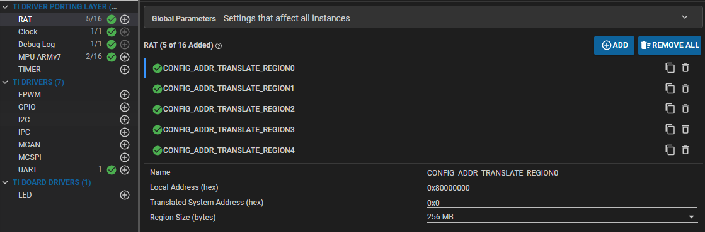
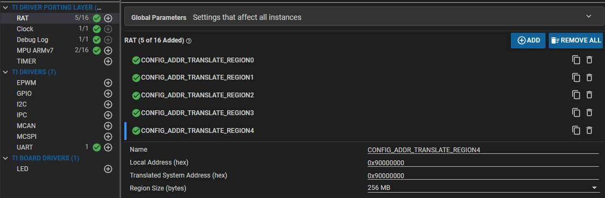
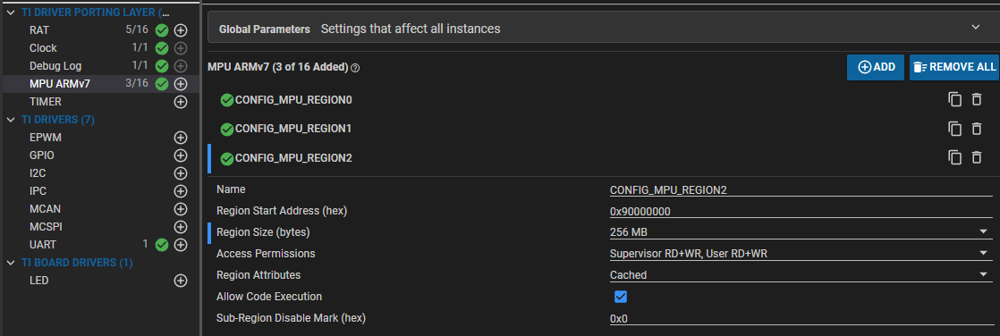

## 大概步骤
1.将官方M4F示例程序导入CSS工程
2.指定 DDR 的内存区域linker.cmd以运行和加载程序
3.在 example.syscfg 中添加 M4F 的 RAT 配置以访问 DDR。
4.在 example.syscfg 中添加 MPU 区域以允许从 DDR 执行代码
5.生成并运行程序

### 指定 DDR 在linker.cmd运行和加载程序的内存区域
修改linker.cmd
将SECTIONS{}中除了.vectors，其他都注释
并添加如下
```
	.text: 	 {} palign(8) > DDR_1
	.bss:    {} palign(8) > DDR_1
	RUN_START(__BSS_START)
    RUN_END(__BSS_END)
	.data:   {} palign(8) > DDR_1
	.rodata: {} palign(8) > DDR_1
	.sysmem: {} palign(8) > DDR_1
	.stack:  {} palign(8) > DDR_1

	GROUP {
        .resource_table: {} palign(4096)	/* This is the resource table used by linux to know where the IPC "VRINGs" are located */
    } > DDR_0

	.ARM.exidx:     {} palign(8) > DDR_1
	.init_array:    {} palign(8) > DDR_1
	.fini_array:    {} palign(8) > DDR_1
```
其中
`.vectors`: 它被指定为 M4F 的入口点和向量表，并且它必须位于内存地址 0x0
`.text`: 代码段
`.bss`: 未初始化的全局变量
`.data`: 初始化的全局变量和静态变量
`.rodata`: 常量数据
`.sysmem`: malloc 堆
`.stack`: 主堆栈

在MEMORY{}中添加
```
    /* when using multi-core application's i.e more than one R5F/M4F active, make sure
     * this memory does not overlap with R5F's
     */
    /* Resource table must be placed at the start of DDR_0 when M4 core is early booting with Linux */
    DDR_0       : ORIGIN = 0x9CC00000 , LENGTH = 0x1000
    DDR_1       : ORIGIN = 0x9CB00000 , LENGTH = 0x100000
```
其中
`M4F_VECS` M4F的入口点和向量表所在的区域，原点为 0x00000000，长度为 0x00000200
`M4F_IRAM` 指令RAM所在的区域，原点为0x00000200，长度为0x0002FE00
`M4F_DRAM` 数据RAM所在的区域，位于0x00030000的原点，长度为0x00010000。
`DDR_0` DDR_0内存的区域，原点为 0x9CC00000，长度为 0x1000
`DDR_1` DDR_1内存的区域，原点为 0x9CB00000，长度为 0x100000

### 配置 RAT
打开工程中的example.syscfg
CONFIG_ADDR_TRANSLATE_REGION_0的大小从 512MB 更改为 256MB

添加新的 RAT 区域CONFIG_ADDR_TRANSLATE_REGION_4


### 配置MPU区域
添加 MPU 区域以允许从 DDR 执行代码


### 构建项目并且运行
运行报错
remoteproc remoteproc0: bad phdr da 0x9cb00000 mem 0xb800

查看linux设备树中预留内存
```
reserved-memory {
    ···
    mcu_m4fss_memory_region: m4f-memory@9cc00000 {
			compatible = "shared-dma-pool";
			reg = <0x00 0x9cc00000 0x00 0xe00000>;
			no-map;
		};
    ···
}
```
范围0x9cc00000 - 0x9da00000

MEMORY中改为
```
    DDR_0       : ORIGIN = 0x9CC00000 , LENGTH = 0x1000
    DDR_1       : ORIGIN = 0x9CE00000 , LENGTH = 0x100000
```
编译运行成功