# OTP efuse
Ti官方例程
使用的MCU SDK 9.2
CCS
导入例程
sbl_uart_uniflash_stage2_am62x-sk_r5fss0-0_nortos_ti-arm-clang
直接编译，这个例程用于将后面的r5f核程序写入nor flash中。
注意：nor flash型号与官方EVK板一致，S28HS512TGA，不然需要修改这个工程源码，适配nor flash
生成文件
sbl_uart_uniflash_stage2_am62x-sk_r5fss0-0_nortos_ti-arm-clang.appimage

导入例程
ext_otp_am62x-sk_r5fss0-0_nortos_ti-arm-clang
修改main.c
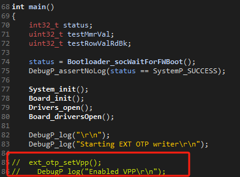
编译，生成
ext_otp_am62x-sk_r5fss0-0_nortos_ti-arm-clang.tiimage

在Ubuntu虚拟机中，安装一下mcu sdk
进入目录
mcu_plus_sdk_am62x_09_02_01_06/tools/boot
将上面两个工程生成的文件拷贝到这个目录下面
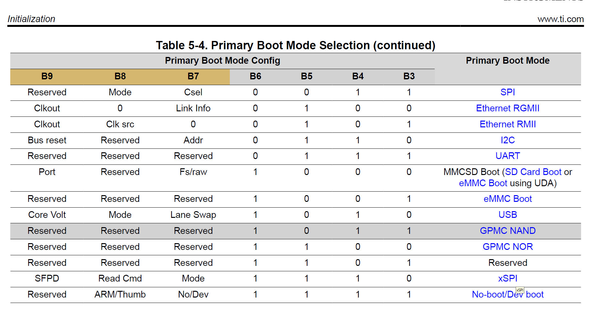
修改../../examples/otp/ext_otp/am62x-sk/r5fss0-0_nortos/default_ext_otp.cfg
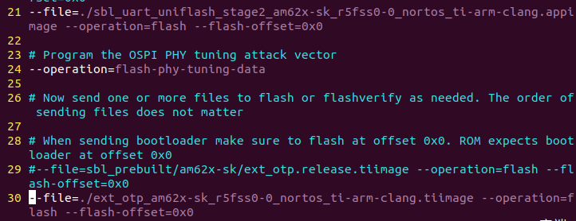
```
--file=./sbl_uart_uniflash_stage2_am62x-sk_r5fss0-0_nortos_ti-arm-clang.appi    mage --operation=flash --flash-offset=0x0

--file=./ext_otp_am62x-sk_r5fss0-0_nortos_ti-arm-clang.tiimage --operation=f    lash --flash-offset=0x0
```
将开发板拨码开关从 UART 模式启动
串口连接虚拟机
sudo python3 uart_uniflash.py -p /dev/ttyACM0 --cfg=../../examples/otp/ext_otp/am62x-sk/r5fss0-0_nortos/default_ext_otp.cfg
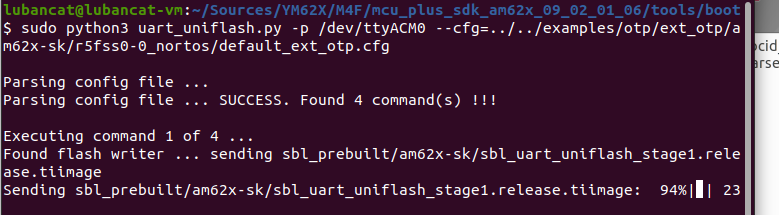
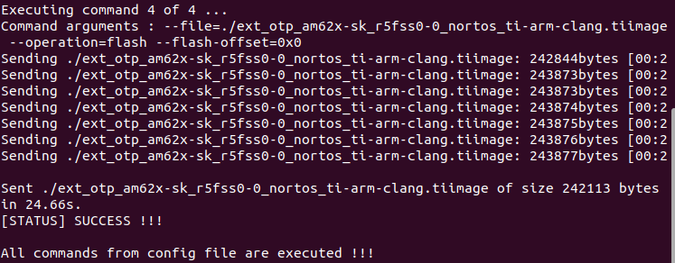
烧写完成，r5f程序已经到nor flash中

将开发板拨码开关从nor flash模式启动
调试串口插到wakeup_uart0
运行后报错，写入OTP ROW失败

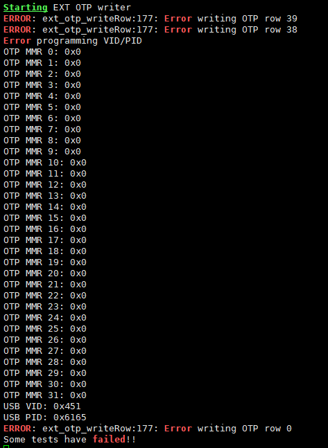

量核心板R16，没有开启VPP_1V8电源
修改代码
配置gpio
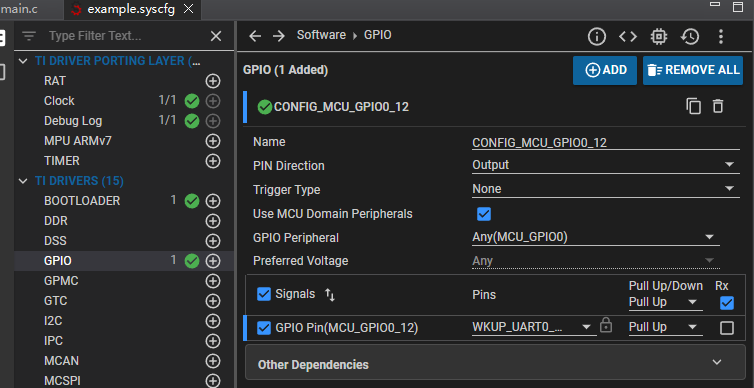
然后编译一次
在Debug/syscfg/ti_pinmux_config.c中查看有没有配置成功
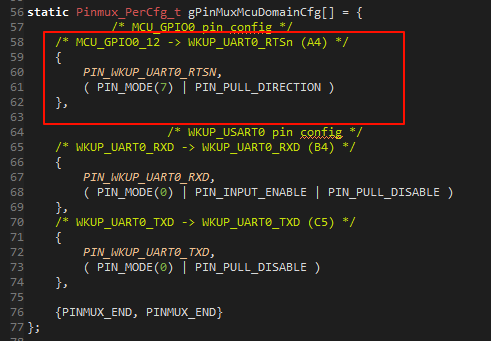
main.c
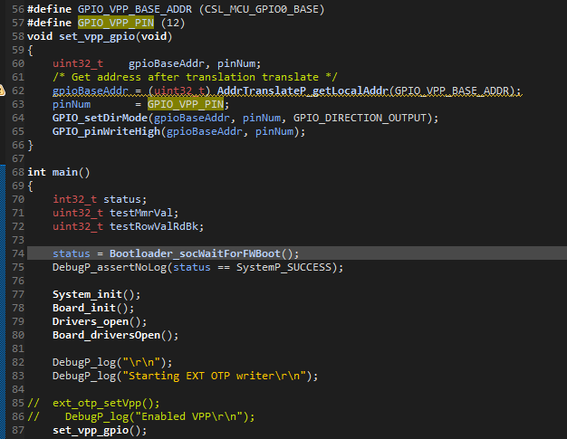

运行
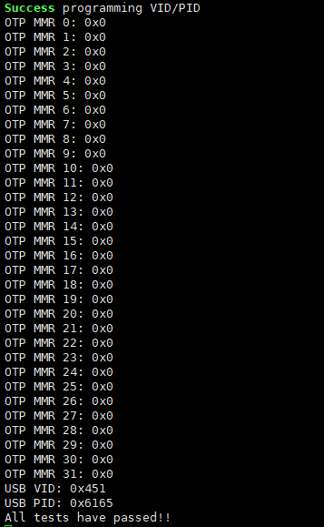

重新上电运行一下OTP的值才会被MMR寄存器获取，这时再读MMR才是OTP里面的值
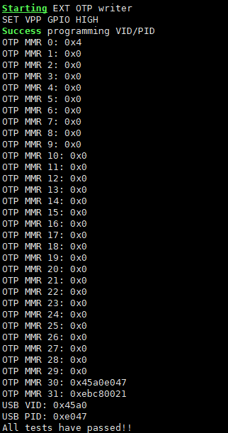

改写代码锁OTP
实现锁OTP ROW
ext_otp.c
```
/**
 * \brief Request message for hardware locking an OTP row
 *
 * \param rowIdx Index of the otp row to be written. Index starts from zero.
 * \param hwWriteLock    indicates if write lock has to be applied in HW on the current row. Set to 0x5A for write lock.
 * \param hwRriteLock     indicates if read lock has to be applied in HW on the current row. Set to 0x5A for read lock.
 *
 * In all cases 0x5A indicates true and 0xA5 indicates false. All other values are invalid.
 */
int32_t ext_otp_lockRow(uint8_t rowIdx, uint8_t hwWriteLock, uint8_t hwRriteLock, uint8_t rowSoftLock)
{
    int32_t status = SystemP_SUCCESS;
    Sciclient_ReqPrm_t reqParam;
    Sciclient_RespPrm_t respParam;
    struct tisci_msg_lock_otp_row_req request;
    struct tisci_msg_lock_otp_row_resp response;

    request.row_idx           = rowIdx;
    request.hw_write_lock     = hwWriteLock;
    request.hw_read_lock      = hwRriteLock;
    request.row_soft_lock     = rowSoftLock;

    reqParam.messageType      = (uint16_t) TISCI_MSG_LOCK_OTP_ROW;
    reqParam.flags            = (uint32_t) TISCI_MSG_FLAG_AOP;
    reqParam.pReqPayload      = (const uint8_t *) &request;
    reqParam.reqPayloadSize   = (uint32_t) sizeof (request);
    reqParam.timeout          = (uint32_t) SystemP_WAIT_FOREVER;

    respParam.flags           = (uint32_t) 0;   /* Populated by the API */
    respParam.pRespPayload    = (uint8_t *) &response;
    respParam.respPayloadSize = (uint32_t) sizeof (response);

    status = Sciclient_service(&reqParam, &respParam);

    if ( (status==SystemP_SUCCESS) && ((respParam.flags & TISCI_MSG_FLAG_ACK) == TISCI_MSG_FLAG_ACK) )
    {
        DebugP_log("Success lock OTP row %d\r\n", rowIdx);
    }
    else
    {
        DebugP_logError("Error lock OTP row %d \r\n", rowIdx);
        status = SystemP_FAILURE;
    }

    return status;
}
```
实现读OTP ROW锁状态
ext_otp.c
```
/**
 * \brief Request message for hardware locking an OTP row
 *
 * \param rowIdx Index of the otp row to be written. Index starts from zero.
 *
 * In all cases 0x5A indicates true and 0xA5 indicates false. All other values are invalid.
 */
int32_t ext_otp_get_lockRow(uint8_t rowIdx)
{
    uint8_t globalSoftLock;
    uint8_t hwWriteLock;
    uint8_t hwReadLock;
    uint8_t rowSoftLock;

    int32_t status = SystemP_SUCCESS;
    Sciclient_ReqPrm_t reqParam;
    Sciclient_RespPrm_t respParam;
    struct tisci_msg_get_otp_row_lock_status_req request;
    struct tisci_msg_get_otp_row_lock_status_resp response;

    request.row_idx           = rowIdx;

    reqParam.messageType      = (uint16_t) TISCI_MSG_GET_OTP_ROW_LOCK_STATUS;
    reqParam.flags            = (uint32_t) TISCI_MSG_FLAG_AOP;
    reqParam.pReqPayload      = (const uint8_t *) &request;
    reqParam.reqPayloadSize   = (uint32_t) sizeof (request);
    reqParam.timeout          = (uint32_t) SystemP_WAIT_FOREVER;

    respParam.flags           = (uint32_t) 0;   /* Populated by the API */
    respParam.pRespPayload    = (uint8_t *) &response;
    respParam.respPayloadSize = (uint32_t) sizeof (response);

    status = Sciclient_service(&reqParam, &respParam);

    if ( (status==SystemP_SUCCESS) && ((respParam.flags & TISCI_MSG_FLAG_ACK) == TISCI_MSG_FLAG_ACK) )
    {
//        DebugP_logInfo("Success get OTP row %d\r\n", rowIdx);
        DebugP_logInfo("Success get OTP row %d\r\n", rowIdx);
        globalSoftLock = response.global_soft_lock;
        hwWriteLock = response.hw_write_lock;
        hwReadLock = response.hw_read_lock;
        rowSoftLock = response.row_soft_lock;

        DebugP_log("========================\r\n");
        DebugP_log("OTP ROW:        %d\r\n", rowIdx);
        DebugP_log("globalSoftLock: 0x%x\r\n", globalSoftLock);
        DebugP_log("hwWriteLock:    0x%x\r\n", hwWriteLock);
        DebugP_log("hwReadLock:     0x%x\r\n", hwReadLock);
        DebugP_log("rowSoftLock:    0x%x\r\n", rowSoftLock);
        DebugP_log("========================\r\n");
    }
    else
    {
        DebugP_logError("Error get OTP row %d \r\n", rowIdx);
        status = SystemP_FAILURE;
    }

    return status;
}
```

## 参考链接
https://software-dl.ti.com/mcu-plus-sdk/esd/AM62X/09_02_01_06/exports/docs/api_guide_am62x/EXAMPLES_EXT_OTP.html