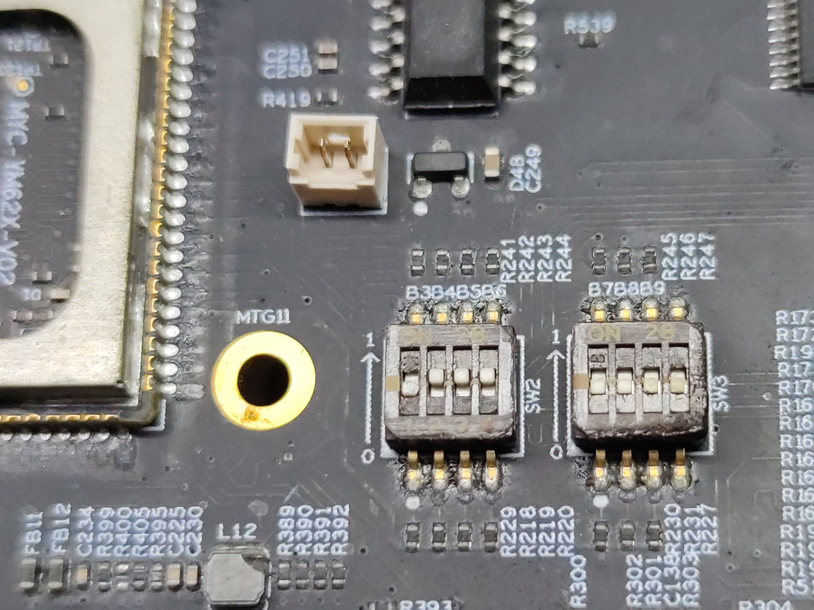

烧录命令：
```
sf probe
SF: Detected s28hs512t with page size 256 Bytes, erase size 256 KiB, total 64 MiB
load mmc 0 ${loadaddr} tiboot3.bin
sf update $loadaddr 0x0 $filesize
load mmc 0 ${loadaddr} tispl.bin
sf update $loadaddr 0x80000 $filesize
load mmc 0:2 ${loadaddr} boot u-boot-qspi.img
sf update $loadaddr 0x280000 $filesize
load mmc 0 ${loadaddr} ospi_phy_pattern
sf update $loadaddr 0x3fc0000 $filesize
load mmc 0:2 ${loadaddr} boot/dtb/myir/myd-y62x-6252.dtb
sf update $loadaddr 0x6c0000 $filesize
load mmc 0:2 ${loadaddr} boot/Image
sf update $loadaddr 0x800000 $filesize
```
如果已经烧录过需要先擦除，擦除命令：
sf erase 0x0 0x2000000
```
uboot ospi启动文件系统命令：
sf probe
setenv boot mmc
setenv bootpart 0:2
setenv get_kern_ospi 'sf read ${kernel_addr_r} 0x800000 0x17c0000'
setenv get_fdt_ospi 'sf read ${fdt_addr_r} 0x6c0000 0x40000'
setenv boot_targets 'qspi ti_mmc mmc0 mmc1 usb0 pxe dhcp'
setenv bootcmd_qspi 'sf probe;run findfdt; run init_${boot}; run main_cpsw0_qsgmii_phyinit; run boot_rprocs; if test ${boot_fit} -eq 1; then run get_fit_${boot}; run get_overlaystring; run run_fit; else; run get_kern_ospi; run get_fdt_ospi; run get_overlay_${boot}; run run_kern; fi;'
```
```
run bootcmd_qspi
```