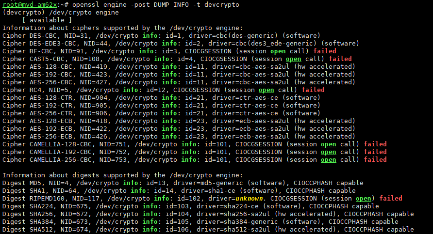
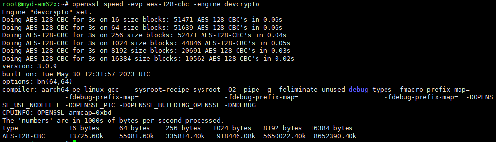

git clone https://github.com/cryptodev-linux/cryptodev-linux.git

git checkout e0c25e289d6baf1d83c2b9cb523d3bc237d0c0c9

git apply 0001-Disable-installing-header-file-provided-by-another-p.patch

0001-Disable-installing-header-file-provided-by-another-p.patch
```
From 8a884f55bd1527baa82fab68c186ba546273860c Mon Sep 17 00:00:00 2001
From: Denys Dmytriyenko <denys@ti.com>
Date: Sun, 6 Apr 2014 19:51:39 -0400
Subject: [PATCH] Disable installing header file provided by another package

Signed-off-by: Denys Dmytriyenko <denys@ti.com>

Upstream-Status: Inappropriate [ OE specific ]
---
 Makefile | 1 -
 1 file changed, 1 deletion(-)

diff --git a/Makefile b/Makefile
index 5a080e0..bf02396 100644
--- a/Makefile
+++ b/Makefile
@@ -33,7 +33,6 @@ install: modules_install
 
 modules_install:
 	$(MAKE) $(KERNEL_MAKE_OPTS) modules_install
-	install -m 644 -D crypto/cryptodev.h $(DESTDIR)/$(includedir)/crypto/cryptodev.h
 
 clean:
 	$(MAKE) $(KERNEL_MAKE_OPTS) clean
```

make KERNEL_DIR=/home/lubancat/Sources/YM62X/myir-ti-linux-myd-am62x-linux-6.1.46 PREFIX=/home/lubancat/Sources/YM62X/cryptodev/install -j

make KERNEL_DIR=/home/lubancat/Sources/YM62X/myir-ti-linux-myd-am62x-linux-6.1.46 PREFIX=/home/lubancat/Sources/YM62X/cryptodev/install install

## 硬件加密测试
查看是否加载模块
lsmod | grep cryptodev
查看哪些支持硬件加速


### AES-128-CBC
openssl speed -evp aes-128-cbc -engine devcrypto

