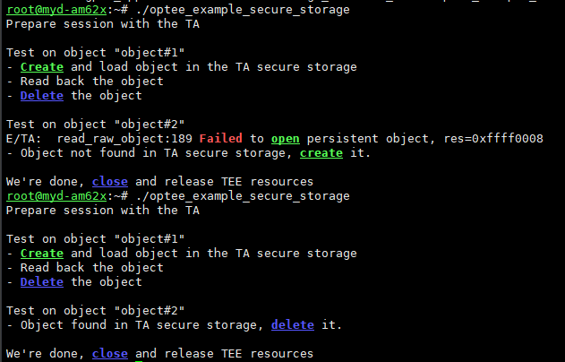

## Secure Storage
optee源码
```
make clean
rm out -r
make CROSS_COMPILE64=aarch64-none-linux-gnu- CROSS_COMPILE=arm-none-linux-gnueabihf- PLATFORM=k3-am62x CFG_ARM64_core=y CFG_RPMB_FS=y CFG_RPMB_TESTKEY=y CFG_RPMB_WRITE_KEY=y CFG_TEE_CORE_LOG_LEVEL=2 CFG_TEE_CORE_DEBUG=y -j16
```
然后重新编译uboot
替换u-boot.img和tispl.bin
## 编译例程
```
git clone https://github.com/linaro-swg/optee_examples
cd optee_examples/secure_storage
make TA_DEV_KIT_DIR=/home/lubancat/Sources/YM62X/myir-ti-bootloader/myir-ti-optee/out/arm-plat-k3/export-ta_arm64 -j
```
## 部署
生成的.ta文件放到/lib/optee_armtz
然后运行host侧的可执行文件
运行


