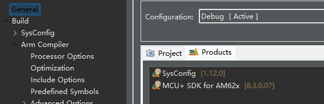

### M33例程
下载SDK 8.3 和 sysconfig 1.12
```
https://www.ti.com/tool/download/MCU-PLUS-SDK-AM62X/08.03.00.07
```
下载zero_copy例程
```
git clone git://git.ti.com/rpmsg/rpmsg_char_zerocopy.git
```
在CCS中导入工程,报错
修改makefile_projectspec，将2个Cortex M.AM64x.AM62x_SK_EVM改为
```
Cortex M.AM62x.AM62x_SK_EVM
```
右键工程Properties，改为对应版本

编译

### kernel例程
修改设备树
根节点下添加
```
/ {
···
    dma_buf_phys {
        compatible = "ti,dma_buf_phys";
    };
···
}
```
```
reserved-memory {
    ···
    apps-shared-memory {
                compatible = "dma-heap-carveout";
                reg = <0x00 0xa6000000 0x00 0x2000000>;
                no-map;
    };
    ···
}
```
编译替换设备树
测试
使用默认模式测试128k buffer
```
./rpmsg_char_zerocopy -r 9 -s 128
```
使用分配名字为apps-shared-memory的缓冲区，并测试1M
```
./rpmsg_char_zerocopy -r 9 -e carveout_apps-shared-memory
```