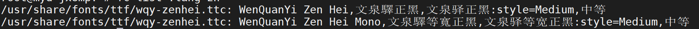

## 问题现象
weston终端显示中文文件只显示一个方框
使用yocto编译出来的文件系统，不带中文字库

## 解决
### 下载中文字体
下载一个ttc或者tty的中文字库

复制文件到如下
```
/usr/share/fonts/tty
```
或者
```
/usr/share/fonts/truetype
```
更新字库
```
fc-cache -v -f
```
显示支持中文的字库
```
fc-list :lang=zh
```


weston-terminal.c源码中默认使用mono
```
3119 weston_config_section_get_string(s, "font", &option_font, "mono");
3120 weston_config_section_get_int(s, "font-size", &option_font_size, 14);
```
更改fonts.conf
```
vi /etc/fonts/fonts.conf
```
将下面
```
<edit name="family" mode="assign" binding="same">
        <string>monospace</string>
</edit>

```
改成对应字库名字
```
<edit name="family" mode="assign" binding="same">
        <string>WenQuanYi Zen Hei</string>
</edit>
```
重启weston终端可以看到中文显示