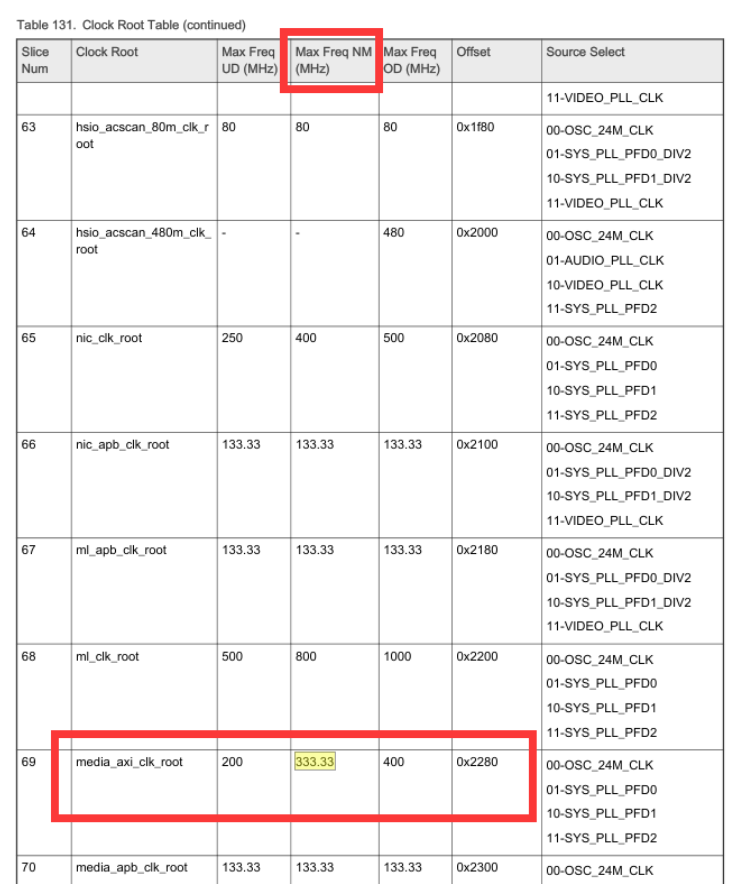

## linux 6.1

```
assigned-clock-rates = <PIXCLK * (父时钟频率3倍或7倍)>, <PIXCLK>, <400000000 (media_axi_root)>, <133333333>;
```
查看实际video_pll
cat /sys/kernel/debug/clk/video_pll/clk_rate
cat /sys/kernel/debug/clk/media_axi_root/clk_rate
cat /sys/kernel/debug/clk/media_disp_pix_root/clk_rate
如果没有需要修改pll数组
drivers/clk/imx/clk-fracn-gppll.c
找到static const struct imx_fracn_gppll_rate_table fracn_tbl[]
添加自己需要的PLL分频参数
### 公式
```
 * The (Fref / rdiv) should be in range 20MHz to 40MHz
 * The Fvco should be in range 2.5Ghz to 5Ghz
#define PLL_FRACN_GP(_rate, _mfi, _mfn, _mfd, _rdiv, _odiv) \
{ \
.rate = (_rate), \
.mfi = (_mfi), \
.mfn = (_mfn), \
.mfd = (_mfd), \
.rdiv = (_rdiv), \
.odiv = (_odiv), \
}
Fref = 24MHz
Fvco = Fref * (mfi + mfn / mfd)
Fout = Fvco / (odiv + rdiv)
```
### 举例
```
PLL_FRACN_GP(445333333U, 167, 0, 1, 0, 9),
Fvco= 24(Mhz) x (167+0/1)=4008, rate=4008/(9+0)=445.333333
```
最终输出lvds_clk = Fout / 7

### 注意时钟
大于200M，小于333Mhz
