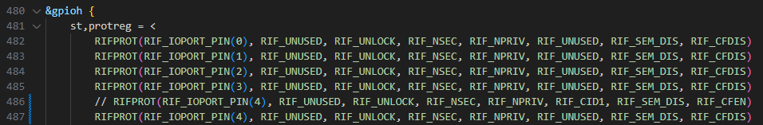

## M核访问报错
以PH4举例，默认是bootrom，RIF的配置PH4默认只能由A35控制

修改optee
myir-st-optee/core/arch/arm/dts/myb-stm32mp257x-rif.dtsi


删除build目录，运行build-uboot-zh.sh脚本重新编译

## linux无法导出
gpioinfo后显示类似如下，但是uboot和linux都没有调用这个引脚
```
line   8:	"PI8"           	input consumer="kernel"
```
解决：
修改st-arm-trusted-firmware
drivers/st/gpio/stm32_gpio.c

```
static void set_gpio(···)
{
    ···
#if !STM32MP_M33_TDCID
	set_gpio_secure_cfg(bank, pin, true);
#endif
#endif /* STM32MP13 || STM32MP15 */
}
```
改成如下
```
static void set_gpio(···)
{
    ···
#if !STM32MP_M33_TDCID
    if (bank == GPIO_BANK_I && (pin == 8))
        set_gpio_secure_cfg(bank, pin, false);
    else
        set_gpio_secure_cfg(bank, pin, true);
#endif
#endif /* STM32MP13 || STM32MP15 */
}
```