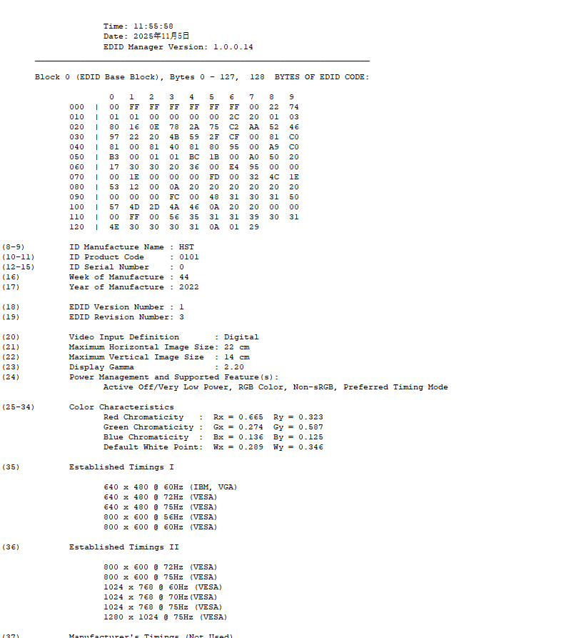

## 查看edid
hexdump -C /sys/class/drm/card0-HDMI-A-1/edid
## 解析edid
使用EDID Manager
先把edid拷贝到windows上
cat /sys/class/drm/card0-HDMI-A-1/edid > ~/edid.bin
解析后


## Established Timings
预定义固定参数，源设备优先解析Established Timings

驱动位置
myir-imx-linux/drivers/gpu/drm/drm_edid.c
修改下面这个结构体
```
static const struct drm_display_mode edid_est_modes[]
```
## Standard Timings
动态计算
```
static const struct drm_display_mode drm_dmt_modes[]
```
## Detailed Timings

## Video Data Block