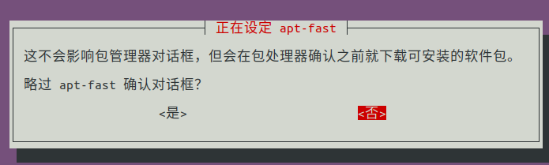

## 添加下载源
```
sudo add-apt-repository ppa:apt-fast/stable
```
## 安装 apt-fast
```
sudo apt-get install apt-fast
```
弹出界面我们选择 apt-get
将线程数设置为16
弹出的界面我们选择否即可

## 使用
与 apt-get 功能相似
```
apt-fast install package
 
apt-fast remove package
 
apt-fast update
 
apt-fast upgrade
 
apt-fast dist-upgrade
```

## 重新配置 apt-fast
```
sudo dpkg-reconfigure apt-fast
```