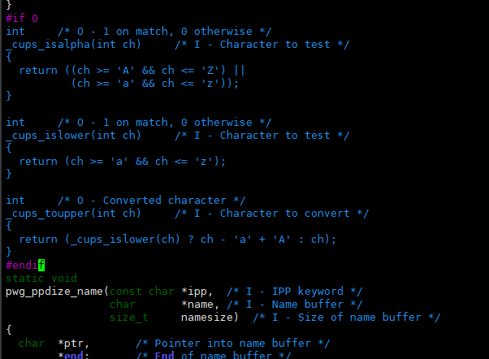

## 基本命令
查看所有能访问的打印机
```
lpinfo -v
```
添加USB打印机
```
lpadmin -p <打印机名称> -E -v <USB设备URI> -P <PPD驱动文件路径>
```
例如
```
lpadmin -p Test_Printer -v usb://HP/Laser%201003-1008?serial=CNC1T7H05P -P /home/root/Test_Printer.ppd -E
```
设置默认打印机
```
lpadmin -d Test_Printer
```
查看默认打印机
```
lpstat -d
```
查看所有信息
```
lpstat -t
```
删除打印机
```
lpadmin -x Test_Printer
```
查看打印机支持的参数
```
lpoptions -p HP_Laser_1003_1008 -l
```

### 打印
启用打印机
```
lpadmin -p HP_Laser_1003_1008 -E
```
格式转换
pdf转ps
```
# 将 test.pdf 转换为 test.ps，输出到当前目录
gs -dSAFER -dBATCH -dNOPAUSE -sDEVICE=ps2write -sOutputFile=test.ps test.pdf
```
pdf转cups-raw光栅格式
```
需要移植
```
https://bgithub.xyz/openharmony/third_party_cups-filters.git
```
lp -d HP_Laser_1003_1008 -o PageSize=A4 test.pdf
```
删除打印任务
用lpstat -t查看打印任务，然后用lprm删除，最后一个参数是任务序列号
```
lprm -P HP_Laser_1003_1008 1
```
禁用打印机
cupsdisable HP_Laser_1003_1008


### 错误日志
cat /var/log/cups/error_log

### ipptool
查询
ipptool -tv ipp://localhost:631/printers/HP_Laser_1003_1008 get-printer-attributes.test

### 配置文件
/usr/share/cups/mime/mime.convs

## 移植third_party_cups-filters
git clone https://github.com/openharmony/third_party_cups-filters.git
修改
Makefile
```
CUPS_LIBS = -lcups -lcupsimage 
```
修改utils/cups-browsed.c


交叉编译
```
./configure --host aarch64 --prefix="/usr" with_random=no --enable-static=no
make -j16
make install DESTDIR="$PWD/00_install" -j16
```
cp 00_install/usr/lib/cups/filter/* /usr/libexec/cups/filter/
修改配置文件，创建pdf到cups-raster的链接
vi /usr/share/cups/mime/mime.convs
```
application/pdf  application/vnd.cups-raster  100  pdftoraster
```
如果要打印图片，添加图片的链接
```
image/jpeg  application/vnd.cups-raster  100  imagetoraster
```