### 环境
**平台:RZ/G2L**
**LVGL版本:8.3**   
**Ubuntu22.04**

### 下载LVGL源码
打开 LVGL 的 Github 主页，分别下载 lvgl、lv_drivers、lv_port_linux_frame_buffer 仓库源码
```
lvgl：                      https://github.com/lvgl/lvgl/releases/tag/v8.3.11
lv_drivers：                https://github.com/lvgl/lv_drivers/releases/tag/v8.3.0
lv_port_linux_frame_buffer：https://github.com/lvgl/lv_port_linux/releases/tag/v7.0.0
```
### 创建工程
解压
1.创建 lvgl_demo 文件夹；
2.把 lvgl-8.3.11 复制进 lvgl_demo 文件夹，并重命名为 lvgl；
3.把 lv_drivers-8.3.0 复制进 lvgl_demo 文件夹，重命名为 lv_drivers；
3.将 lv_port_linux-master 中的 main.c 文件和 makefile 文件复制到 lvgl_demo 中；
4.将 lvgl 中的 lv_conf_template.h 文件复制到 lvgl_demo 中并且改名为 lv_conf.h；
5.将 lv_drivers 中的 lv_drv_conf_template.h 文件复制到 lvgl_demo 中并且改名为 lv_drv_conf.h；
6.创建好的工程目录如图所示

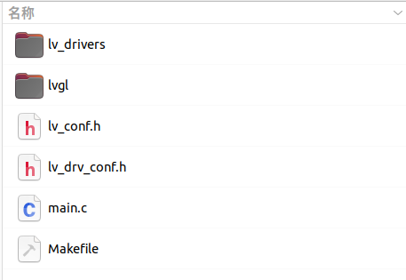

### 修改配置
强烈建议打开log
凡是涉及到宏的修改，都需要重新编译，make clean，然后再make
#### 修改 lv_drv_conf.h
将 #if 0 改成 #if 1：

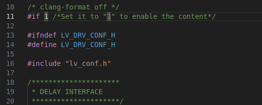

将 USE_FBDEV 的值改为 1，使能 frame buffer 设备：

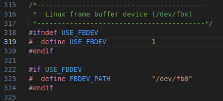

将 USE_EVDEV 的值改为 1，EVDEV_NAME 配置触控输入设备的文件路径：

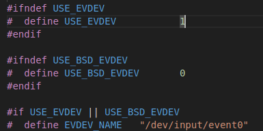

#### 修改 lv_conf.h

将 #if 0 改成 #if 1：

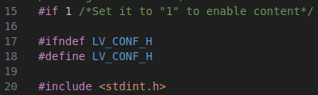

修改 LV_MEM_SIZE 根据实际情况适当扩大内存：

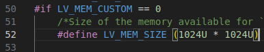

LV_DISP_DEF_REFR_PERIOD 这里可以修改刷新频率，默认为 30ms：

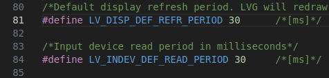

配置 Tick：

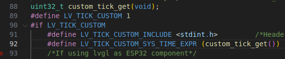

使能 widgets demo：

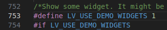

修改宏 LV_COLOR_DEPTH
根据使用的屏幕色彩位数决定

### 修改 main.c

```
#include "lvgl/lvgl.h"
#include "lvgl/demos/lv_demos.h"
#include "lv_drivers/display/fbdev.h"
#include "lv_drivers/indev/evdev.h"
#include <unistd.h>
#include <time.h>
#include <sys/time.h>

#define DISP_HEIGHT     (1920)
#define DISP_WIDTH      (1080)
#define DISP_BUF_SIZE (DISP_HEIGHT * DISP_WIDTH)

int main(void)
{
    lv_init();

    /*Linux frame buffer device init*/
    fbdev_init();

    /*A small buffer for LittlevGL to draw the screen's content*/
    static lv_color_t buf[DISP_BUF_SIZE];

    /*Initialize a descriptor for the buffer*/
    static lv_disp_draw_buf_t disp_buf;
    lv_disp_draw_buf_init(&disp_buf, buf, NULL, DISP_BUF_SIZE);

    /*Initialize and register a display driver*/
    static lv_disp_drv_t disp_drv;
    lv_disp_drv_init(&disp_drv);
    disp_drv.draw_buf = &disp_buf;
    disp_drv.flush_cb = fbdev_flush;
    disp_drv.hor_res = DISP_HEIGHT;
    disp_drv.ver_res = DISP_WIDTH;
    lv_disp_drv_register(&disp_drv);

    /* Linux input device init */
    evdev_init();

    /* Initialize and register a display input driver */
    lv_indev_drv_t indev_drv;
    lv_indev_drv_init(&indev_drv);      /*Basic initialization*/

    indev_drv.type = LV_INDEV_TYPE_POINTER;
    indev_drv.read_cb = evdev_read;
    lv_indev_t *my_indev = lv_indev_drv_register(&indev_drv);

    /*Create a Demo*/
    lv_demo_widgets();

    /*Handle LVGL tasks*/
    while (1)
    {
        lv_timer_handler();
        usleep(5000);
    }

    return 0;
}

/*Set in lv_conf.h as `LV_TICK_CUSTOM_SYS_TIME_EXPR`*/
uint32_t custom_tick_get(void)
{
    static uint64_t start_ms = 0;
    if (start_ms == 0)
    {
        struct timeval tv_start;
        gettimeofday(&tv_start, NULL);
        start_ms = (tv_start.tv_sec * 1000000 + tv_start.tv_usec) / 1000;
    }

    struct timeval tv_now;
    gettimeofday(&tv_now, NULL);
    uint64_t now_ms;
    now_ms = (tv_now.tv_sec * 1000000 + tv_now.tv_usec) / 1000;

    uint32_t time_ms = now_ms - start_ms;
    return time_ms;
}

```
### 修改 Makefile
指定编译器，因为在编译前会设置编译器环境变量，为避免错误，此处注释掉CC，使用环境下默认编译器：

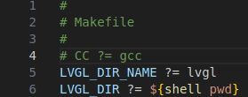

注释掉下面一行
```
#CSRCS 			+=$(LVGL_DIR)/mouse_cursor_icon.c
```
并在上面一行添加 lv_drivers.mk
```
include $(LVGL_DIR)/lv_drivers/lv_drivers.mk
```
### 编译运行
设置交叉编译链的环境变量
```
source /home/xie/SDK/openeuler-sdk/environment-setup-cortexa55-openeuler-linux
make -j8
```
编译成功后在工程目录生成一个可执行文件 demo ，将其复制到开发板上运行

### 添加编译自己文件
在Makefile里添加
CSRCS 			+= $(LVGL_DIR)/目录/文件名字

### 问题
触摸偏移
打开宏 EVDEV_CALIBRATE 修改 EVDEV_HOR_MAX 和 EVDEV_VER_MAX ，修改成自己触摸屏触摸范围。

### lvgl+vscode+sdl模拟器
安装SDL2包
```
sudo apt-get update && sudo apt-get install -y build-essential libsdl2-dev
```
下载官方模拟器
```
# 官方仓库 最新版(9.x可能与8.x的一些API不一样)
git clone --recursive https://github.com/lvgl/lv_sim_vscode_sdl
```
解压后用vscode打开工作区
确保vscode安装了C/C++插件、CMake插件
打开终端，按下F5编译运行或者点击侧边栏的运行和调试，选择Debug LVGL demo with gdb

修改CMakeLists可以添加自己代码，例子如下
```
#添加下面这一行
aux_source_directory(test/ MY_TEST_LIST)
#修改下面这一行
add_executable(main main/src/main.c main/src/mouse_cursor_icon.c ${MY_TEST_LIST})
```

### 中文字体制作
下载思源字体
```
http://photos.100ask.net/lvgl/00_100ask_tools/fonts-zh-source
```
LVGL字体制作官网
```
https://lvgl.io/tools/fontconverter
```
点击Browse选择思源字体文件
Name：生成文件名字
Size：生成字体大小
Bpp：清晰度
Range：选择要生成的Unicode码范围
Symbols：指定要生成哪些Unicode码
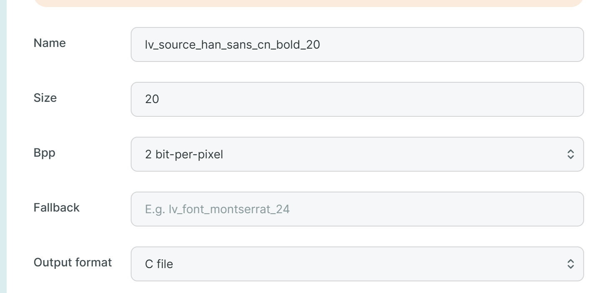
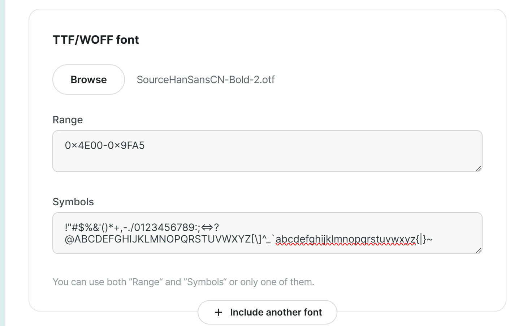
常用中文范围
```
0x4E00-0x9FA5
```
常用符号Symbols
```
!"#$%&'()*+,-./0123456789:;<=>?@ABCDEFGHIJKLMNOPQRSTUVWXYZ[\]^_`abcdefghijklmnopqrstuvwxyz{|}~
```