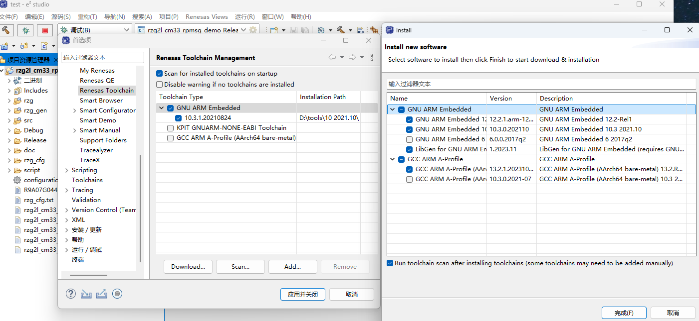
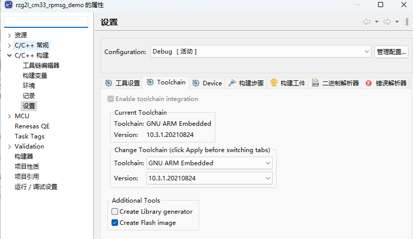
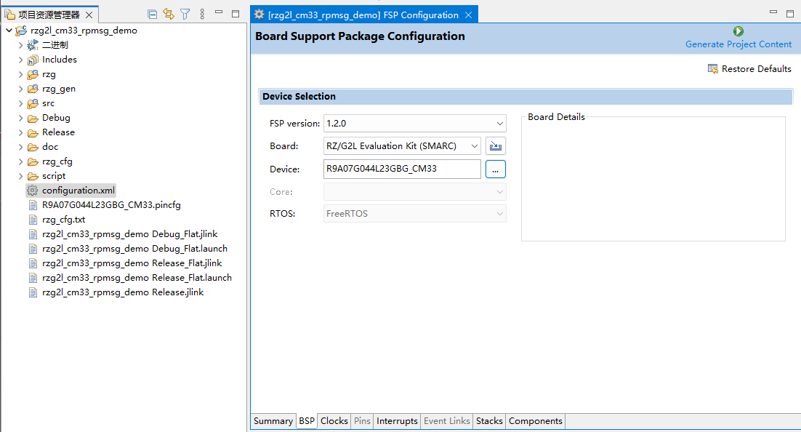

## e2stdio 2022
### 工具链找不到
下载工具链
```
窗口->首选项->Renesas Toolchain->Download
```

导入工具链
点击Add，添加工具链目录

项目添加工具链
```
项目->属性->C/C++构建->设置->Toolchain
```
配置如下


### 编译报错，找不到FSP包
安装FSP包时要选到e2studio的目录下，版本也要和项目对应。

双击configuration.xml
点击BSP可以看见FSP版本有没有，下图是正常读取到FSP
