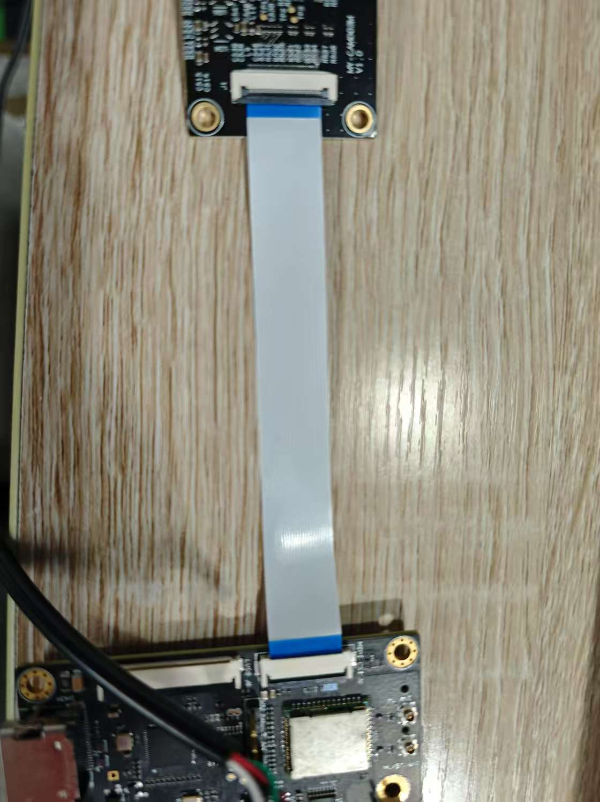
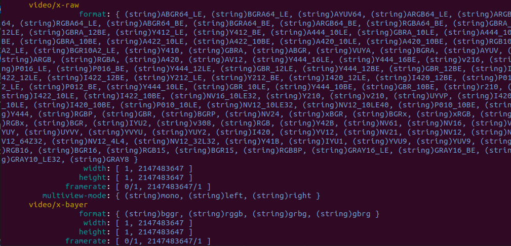
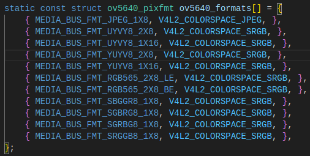

## 没有video
插反了
下面是正确插的方式


## Ubuntu下使用摄像头预览
```
sudo apt install v4l-utils

sudo apt install libgstreamer1.0-dev libgstreamer-plugins-base1.0-dev libgstreamer-plugins-bad1.0-dev gstreamer1.0-plugins-base gstreamer1.0-plugins-good gstreamer1.0-plugins-bad gstreamer1.0-plugins-ugly gstreamer1.0-libav gstreamer1.0-tools gstreamer1.0-x gstreamer1.0-alsa gstreamer1.0-gl gstreamer1.0-gtk3 gstreamer1.0-qt5 gstreamer1.0-pulseaudio

sudo apt install weston

weston --tty=7 &
```
## 初始化摄像头
640x480
```
media-ctl -d /dev/media0 -r
media-ctl -d /dev/media0 -l "'rzg2l_csi2 10830400.csi2':1 -> 'CRU output':0 [1]"
media-ctl -d /dev/media0 -V "'rzg2l_csi2 10830400.csi2':1 [fmt:UYVY8_2X8/640x480 field:none]"
media-ctl -d /dev/media0 -V "'ov5640 0-003c':0 [fmt:UYVY8_2X8/640x480 field:none]"
gst-launch-1.0 v4l2src device=/dev/video0 ! video/x-raw,format=YUY2,width=640,height=480 ! waylandsink
```
1920x1080
```
media-ctl -d /dev/media0 -r
media-ctl -d /dev/media0 -l "'rzg2l_csi2 10830400.csi2':1 -> 'CRU output':0 [1]"
media-ctl -d /dev/media0 -V "'rzg2l_csi2 10830400.csi2':1 [fmt:UYVY8_2X8/1920x1080 field:none]"
media-ctl -d /dev/media0 -V "'ov5640 0-003c':0 [fmt:UYVY8_2X8/1920x1080 field:none]"
gst-launch-1.0 v4l2src device=/dev/video0 ! video/x-raw,format=YUY2,width=1920,height=1080 ! waylandsink
gst-launch-1.0 v4l2src device=/dev/video0 ! autovideosink
```
## 预览摄像头
```
weston --tty=2 &

gst-launch-1.0 v4l2src device=/dev/video0 ! video/x-raw,format=YUY2 ! waylandsink
```
## 硬编码
480p mp4
```
gst-launch-1.0 -e v4l2src device=/dev/video0 ! 'video/x-raw, format=UYVY,width=640,height=480' ! vspmfilter dmabuf-use=true ! video/x-raw,format=NV12 ! omxh264enc control-rate=2 target-bitrate=20485760 interval_intraframes=14 periodicty-idr=2 use-dmabuf=true ! video/x-h264,profile=\(string\)high,level=\(string\)4.2 ! h264parse ! video/x-h264,stream-format=avc,alignment=au ! qtmux ! queue ! filesink location=output.mp4

```
1080p
```
gst-launch-1.0 -e v4l2src device=/dev/video0 ! 'video/x-raw, format=UYVY,width=1920,height=1080' ! vspmfilter dmabuf-use=true ! video/x-raw,format=NV12 ! omxh264enc control-rate=2 target-bitrate=20485760 interval_intraframes=14 periodicty-idr=2 use-dmabuf=false ! video/x-h264,profile=\(string\)high,level=\(string\)4.2 ! h264parse ! video/x-h264,stream-format=avc,alignment=au ! qtmux ! queue ! filesink location=output.mp4
```
调试
--padprobe v:sink --timer name=v
```
gst-launch-1.0 -e --padprobe v:sink --timer v4l2src device=/dev/video0 ! 'video/x-raw, format=UYVY,width=1920,height=1080' ! vspmfilter dmabuf-use=true ! video/x-raw,format=NV12 ! omxh264enc control-rate=2 target-bitrate=20485760 interval_intraframes=14 periodicty-idr=2 use-dmabuf=true ! video/x-h264,profile=\(string\)high,level=\(string\)4.2 ! h264parse ! video/x-h264,stream-format=avc,alignment=au ! qtmux ! queue ! filesink location=output.mp4 name=v
```

## 硬解码
```
gst-launch-1.0 --padprobe v:sink --timer filesrc location=output.mp4 ! qtdemux ! queue ! h264parse ! omxh264dec ! waylandsink name=v
```

查看gst-inspect-1.0支持格式
```
gst-inspect-1.0 videotestsrc --no-colors
```

ov5640支持的格式


media-ctl -d /dev/media0 --print-topology

## hlssink
(没测试过)
```
gst-launch-1.0 -e v4l2src device=/dev/video0 ! 'video/x-raw, format=UYVY,width=640,height=480' ! vspmfilter dmabuf-use=true ! video/x-raw,format=NV12 ! omxh264enc control-rate=2 target-bitrate=20485760 interval_intraframes=14 periodicty-idr=2 use-dmabuf=true ! video/x-h264,profile=\(string\)high,level=\(string\)4.2 ! h264parse ! hlssink max-files=5 playlist-location=/home/root/playlist.m3u8 location=/home/root/segment%05d.ts
```
以下是客户试出来的命令，没有测试过
```
gst-launch-1.0 -e v4l2src device=/dev/video0 ! 'video/x-raw, format=UYVY,width=640,height=480' ! vspmfilter dmabuf-use=true ! video/x-raw,format=NV12 ! omxh264enc control-rate=2 target-bitrate=2048576 interval_intraframes=14 periodicty-idr=2 use-dmabuf=true ! video/x-h264,profile=\(string\)high,level=\(string\)4.2 ! h264parse ! mpegtsmux ! hlssink max-files=5 playlist-root=http://192.168.2.125 playlist-location=/usr/share/apache2/default-site/htdocs/playlist.m3u8 location=/usr/share/apache2/default-site/htdocs/segment%05d.ts
```