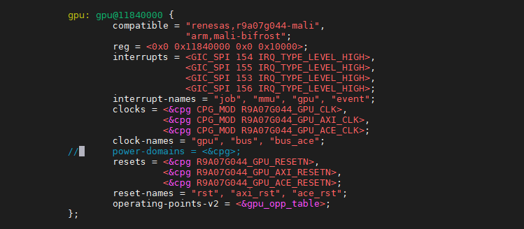
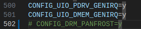
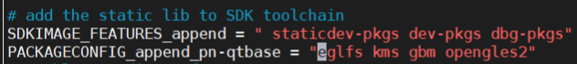

## GPU问题
会一直打印
```
gpu sched timeout
```
## 解决方法(关闭GPU)
关闭gpu
arch/arm64/boot/dts/myir/r9a07g044.dtsi

arch/arm64/configs/mys_g2lx_defconfig
注释CONFIG_DRM_PANFROST


## qt eglfs问题
yocto中修改build-remi下面的conf/local.conf
添加
```
PACKAGECONFIG_append_pn-qtbase =  "eglfs kms gbm opengles2"
```


并且layer中还要加入官方gpu驱动
https://github.com/renesas-rz/meta-rz-panfrost/tree/main/recipes-graphics/mesa

## ubuntu镜像报错gpu超时
原因是ubuntu的桌面不支持mali GPU。
查看gpu
```
sudo apt install mesa-utils
export DISPLAY=:1.0
glxinfo | grep Mesa
```
### 方法一，使用weston桌面(支持GPU)
```
apt autoremove lightdm
apt install weston
```

### 方法二，使用gdm3(内核开启了GPU，但是不会调用GPU)
Lightdm会话管理器不兼容mali GPU
apt autoremove lightdm

卸载LXDE
```
apt autoremove xinit lxde epiphany-browser xine-ui
```
更换镜像源
```
cp /etc/apt/sources.list /etc/apt/sources.list.bk
echo > /etc/apt/sources.list
vi /etc/apt/sources.list
```
```
deb http://mirrors.ustc.edu.cn/ubuntu-ports/ jammy main multiverse restricted universe
deb http://mirrors.ustc.edu.cn/ubuntu-ports/ jammy-backports main multiverse restricted universe
deb http://mirrors.ustc.edu.cn/ubuntu-ports/ jammy-proposed main multiverse restricted universe
deb http://mirrors.ustc.edu.cn/ubuntu-ports/ jammy-security main multiverse restricted universe
deb http://mirrors.ustc.edu.cn/ubuntu-ports/ jammy-updates main multiverse restricted universe
deb-src http://mirrors.ustc.edu.cn/ubuntu-ports/ jammy main multiverse restricted universe
deb-src http://mirrors.ustc.edu.cn/ubuntu-ports/ jammy-backports main multiverse restricted universe
deb-src http://mirrors.ustc.edu.cn/ubuntu-ports/ jammy-proposed main multiverse restricted universe
deb-src http://mirrors.ustc.edu.cn/ubuntu-ports/ jammy-security main multiverse restricted universe
deb-src http://mirrors.ustc.edu.cn/ubuntu-ports/ jammy-updates main multiverse restricted universe
```
更换gdm3会话管理器
```
sudo apt update
sudo apt install gdm3
sudo dpkg-reconfigure gdm3
```
选gdm3回车
报错正常
重启开发板
vi /etc/gdm3/custom.conf
gdm3使用cpu渲染会比较卡
